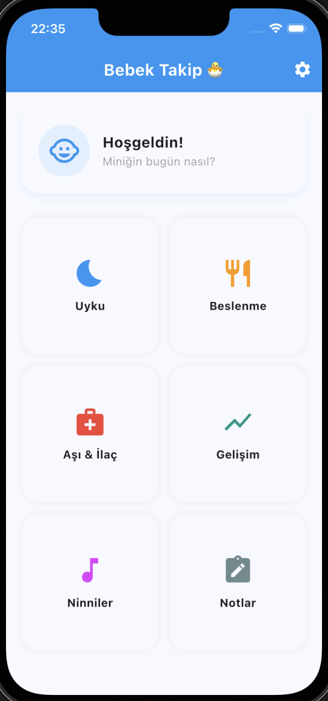
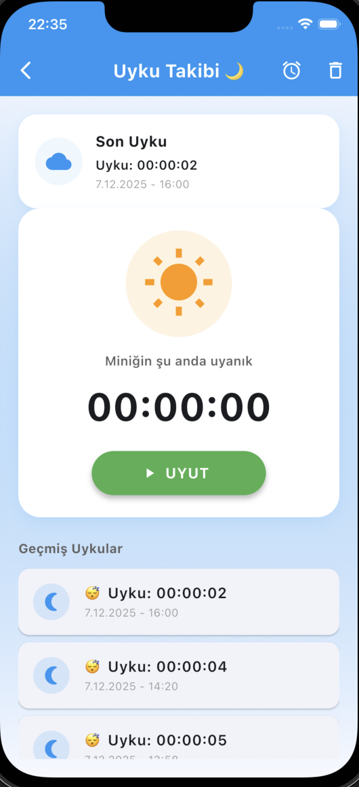
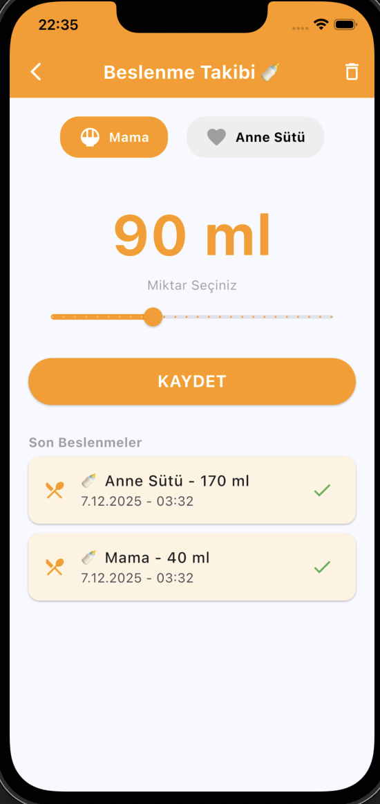
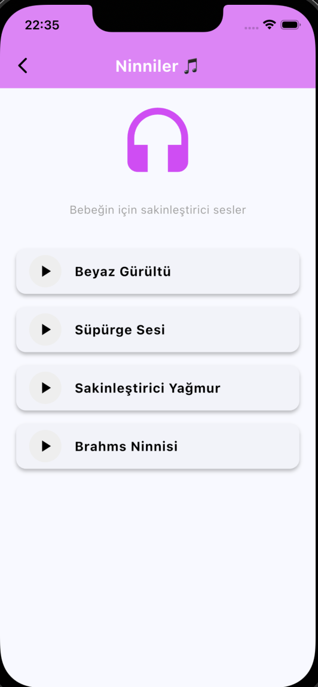
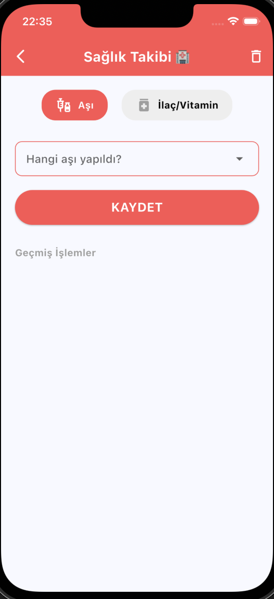
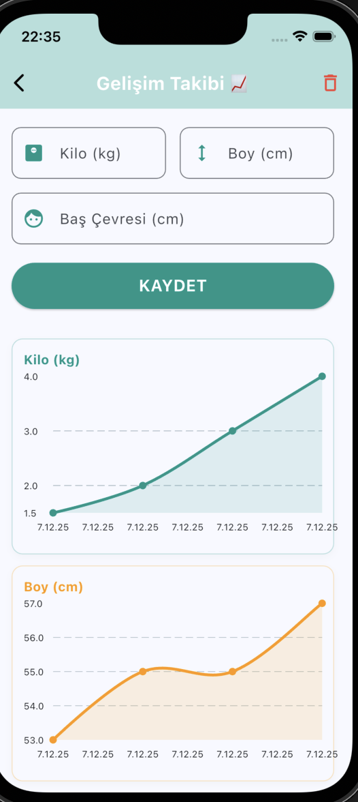

# Baby Tracker 👶  
A Complete Infant Development & Daily Routine App

Baby Tracker is a Flutter-based mobile application that helps parents monitor and organize their baby’s daily activities such as sleep, feeding, growth milestones, medications, and soothing sounds — all within a clean, fast, and intuitive interface.

---

## ✨ Features

### 😴 Sleep Tracking
- Start/stop sleep sessions  
- Automatic duration calculation  
- Daily & weekly sleep history  
- Visual, scrollable logs  

### 🍼 Feeding Tracker
- Formula or breast milk intake  
- Adjustable amount selector  
- History of recent feedings  

### 🎵 Soothing Sounds (Lullabies)
- White noise  
- Rain sounds  
- Vacuum  
- Brahms lullaby  

### 🩺 Health Tracking (Vaccines & Medications)
- Record vaccine name & date  
- Track upcoming doses  
- Quick medication notes  

### 📏 Growth Tracking (Weight / Height / Head Circumference)
- Enter and view growth metrics  
- Auto-generated graphs (fL_chart)
- Animated, interactive charts

## 📸 Screenshots

### 🏠 Home Screen

  

### 🛌 Sleep Tracking

  

### 🍼 Feeding Tracker

  

### 🎧 Lullabies

  

### 💉 Health Tracking

  

### 📈 Growth Tracking

  

🚀 Roadmap (2026)
Q1

Advanced analytics (sleep cycles, feeding trends)

UI/UX polishing and dark mode

Q2

Cloud sync (optional)

Multi-device support

Import/export baby data

Q3

Android release

Localization (ES, DE, FR)

Q4

Premium tier (ad-free + insights)

🧑‍💻 Getting Started (Development)
### 1. Requirements

Flutter SDK 3.10.x or higher

Dart SDK (included with Flutter)

Xcode + iOS Simulator

Android Studio + Android SDK (optional for Android builds)

### 2. Verify Flutter
flutter --version
flutter pub get
flutter run -d ios
flutter run -d android

🧱 Tech Stack

Flutter 3.x

Dart

State Management: setState (lightweight approach)

Charts: fl_chart

Local Storage: SharedPreferences

Custom Widgets

🤝 Contributing

Contributions, bug fixes, and feature ideas are welcome.
Please submit a pull request or open an issue.

## 📄 Privacy Policy

Baby Tracker prioritizes user privacy.

The application does not collect personal data

All records are stored locally on the user’s device

No data is shared with third parties

Advertisements are anonymous and do not identify users

👉 [Read the Privacy Policy (EN)](privacy/privacy-policy-en.md)

📄 License

This project is licensed under the MIT License.

## 🇹🇷 Turkish README  
The Turkish version of this documentation is available here:

[🇹🇷 Turkish README](README.tr.md)