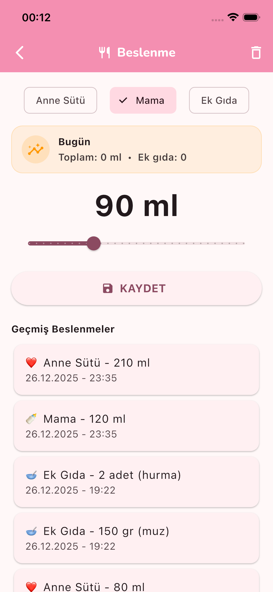
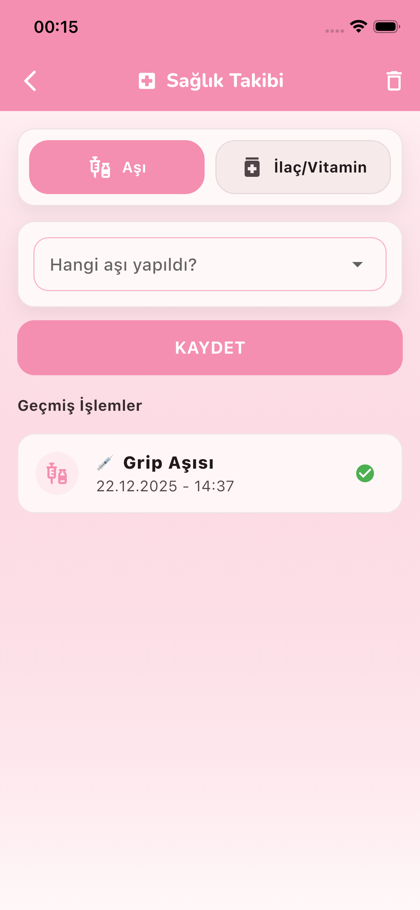

# Baby Tracker 👶  
A Complete Infant Development & Daily Routine App

[🇹🇷 Turkish Version](./README.tr.md)

Baby Tracker is a Flutter-based mobile application designed to help parents easily track and manage their baby’s daily routines and development.  
Sleep, feeding, growth, health records, soothing sounds, and notes are brought together in a clean, fast, and intuitive interface.

The application is developed using **Flutter**. Baby Tracker will be released first on the **Android platform**. The **iOS** version will follow once the product reaches sufficient maturity.

---

## ✨ Key Features

### 😴 Sleep Tracking
- Start / stop sleep sessions  
- Automatic duration calculation  
- Daily and weekly sleep summaries  
- Scrollable sleep history  
- Sleep window reminders (age-based, optional)

### 🍼 Feeding Tracker
- Breast milk, formula, and solid food tracking  
- Quick-entry feeding cards  
- Feeding frequency overview  

### 🎧 Soothing Sounds (Loop Supported)
- White noise  
- Rain sound  
- Vacuum sound  
- Fireplace sound  
- Brahms lullaby  
- Continuous loop playback  
- Optional sleep timer with fade-out  

### 🌙 Night Mode
- Screen dimming for night use  
- Audio playback continues while the screen is locked  
- Contextual hints for parents  

### 💉 Health Tracking (Vaccines & Medications)
- Vaccine and medication records  
- Custom reminders  
- Notification support  

### 📈 Growth Tracking (WHO-based)
- Weight, length, and head circumference records  
- Interactive charts powered by **fl_chart**  
- WHO reference bands (p3–p97)  
- Smart curve smoothing as measurements are recorded  

> **Note:** WHO-based growth evaluations are provided for informational purposes only and do not constitute medical advice, diagnosis, or treatment.

### 📝 Notes
- Free-text notes  
- Date-based organization  

---

## 📸 Screenshots

### 🏠 Home


### 😴 Sleep Tracking


### 🍼 Feeding


### 🎧 Lullabies


### 💉 Health


### 📈 Growth


---

## 🛣️ Roadmap (2026)

### Q1
- Advanced sleep & feeding analytics  
- Dark mode polish  
- Monthly growth reports (PDF)

### Q2–Q3
- Android Play Store release  
- Optional cloud sync  
- Multiple baby profiles  

### Q4+
- Optional premium features (ad-free experience + insights)
- AI-powered routine suggestions  

---

## 🚀 Getting Started (Development)

### Requirements
- Flutter SDK **3.x**  
- Dart SDK (bundled with Flutter)  
- Xcode + iOS Simulator (for iOS)  
- Android Studio + Android SDK (for Android)

### Installation
```bash
git clone https://github.com/gkrarkrn/Baby_Tracker.git
cd Baby_Tracker
flutter pub get
flutter run

🧱 Tech Stack
Flutter 3.x
Dart
State management: lightweight (setState, ChangeNotifier)
Charts: fl_chart
Local storage: shared_preferences
Audio: audioplayers

🤝 Contributing
Contributions are welcome.
If you plan a major change, please open an issue first to discuss your proposal.


📄 Privacy Policy
Baby Tracker prioritizes user privacy.
No personal data is collected
All data is stored locally on the device
No personal data is shared with third parties.
Advertisements, if present, are anonymous and not linked to personal identity.

👉 [Read the Privacy Policy (EN)](privacy/privacy-policy-en.md)

---------------------------------------------------------------------------------------------

📄 License
MIT License © 2026 Göker Arkun