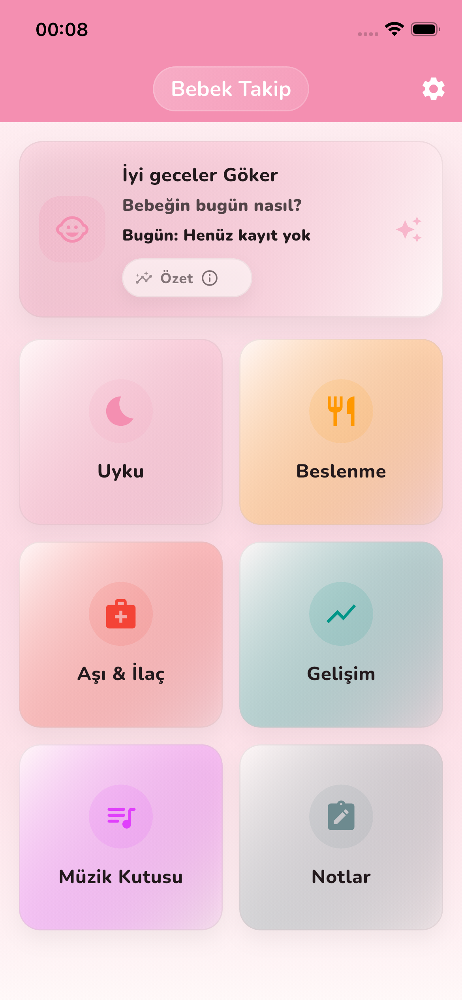
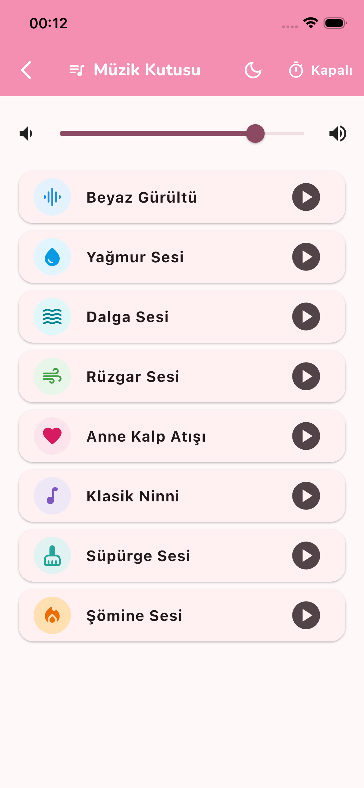
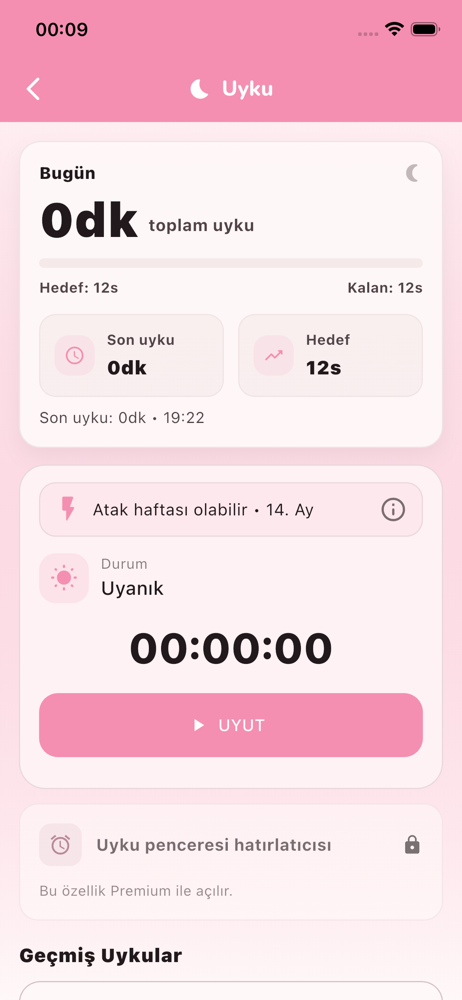
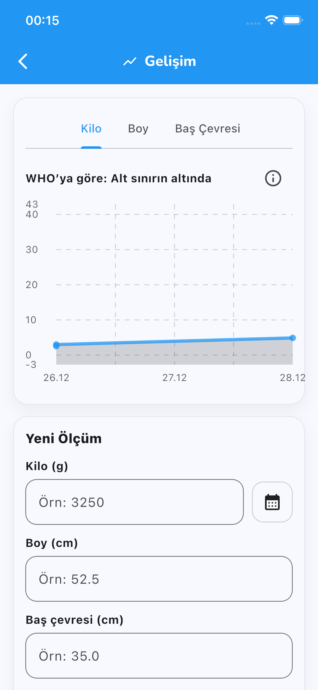

[🇬🇧 English Version](./README.md)

# 🇹🇷 Bebek Takip  
### Tümleşik Bebek Gelişimi ve Günlük Takip Uygulaması

**Bebek Takip**, ebeveynlerin bebeklerinin günlük rutinlerini **kolay, hızlı ve güvenli** şekilde takip edebilmesi için geliştirilmiş modern bir mobil uygulamadır.

Uyku, beslenme, sağlık, gelişim ölçümleri, müzik kutusu (ninniler & beyaz gürültü) ve notlar tek bir akışta toplanır.  
Tüm veriler **yalnızca cihaz üzerinde** saklanır.

Uygulama **Flutter** ile geliştirilmiştir ve **iOS için tam desteklidir**. Android sürümü Play Store yayını için hazırlık aşamasındadır.

---

## 📱 Öne Çıkan Özellikler

### 😴 Uyku Takibi
- Uyku başlangıç & bitiş kayıtları  
- Toplam uyku süresi hesaplama  
- Günlük uyku özeti  
- Otomatik zamanlama desteği  

---

### 🎧 Müzik Kutusu (Ninniler & Uyku Sesleri)
- Beyaz gürültü  
- Yağmur, dalga, rüzgar, süpürge sesi  
- Anne kalp atışı  
- Brahms klasik ninnisi  

**Gelişmiş oynatma özellikleri**
- Otomatik **loop**  
- **Background audio** (ekran kilitliyken çalma)  
- Zamanlayıcı: **20 / 40 / 60 dk + Süre seç**  
- **Gerçek fade-out** (ses kademeli azalır)  
- **Gece modu** (ekran kararma + kullanıcı yönlendirmeleri)

---

### 🍼 Beslenme Takibi
- Anne sütü, mama ve ek gıda kayıtları  
- Beslenme sıklığı görünümü  
- Hızlı kayıt kartları  

---

### 💉 Sağlık Takibi (Aşı & İlaç)
- Aşı geçmişi kaydı  
- Kullanıcı tanımlı ilaç hatırlatmaları  
- Bildirim desteği  

---

### 📈 Gelişim Takibi (WHO Referanslı)
- Kilo, boy ve baş çevresi ölçümleri  
- Grafiksel takip  
- **Dünya Sağlık Örgütü (WHO)** referans bantları (p3–p97)  
- “Alt sınır / Üst sınır” bağlamsal değerlendirme  

---

### 📝 Notlar
- Serbest metin giriş alanı  
- Tarihe göre düzenleme  

---

## 📸 Ekran Görüntüleri

> ⚠️ Görseller güncel UI’yi yansıtmalıdır.  
> Yeni gece modu, müzik kutusu ve WHO grafiklerini içeren ekranlar önerilir.

### 🏠 Ana Sayfa


### 🎧 Müzik Kutusu


### 😴 Uyku Takibi


### 📈 Gelişim Takibi


---

## ⚙️ Teknik Altyapı

- Flutter 3.x  
- iOS background audio desteği  
- Local notification lifecycle yönetimi  

**Kullanılan başlıca paketler**
- `audioplayers` — Müzik kutusu & loop oynatma  
- `flutter_local_notifications` — Aşı / ilaç / zamanlayıcı bildirimleri  
- `shared_preferences` — Yerel veri saklama  
- `fl_chart` — Gelişim grafikleri  
- `flutter_svg` — SVG ikonlar  

---

## 🛣️ Yol Haritası (2026)

### ✔ Tamamlanan
- WHO referanslı büyüme grafikleri  
- Gelişmiş müzik kutusu (timer, loop, fade-out, background audio)  
- Gece modu  

### 🚧 Kısa Vadeli (Q1)
- Android Play Store yayını  
- Çoklu bebek profili desteği  

### 🔮 Orta & Uzun Vadeli
- Opsiyonel bulut senkronizasyonu  
- Aylık gelişim PDF raporu  
- Premium özellikler  
- Yapay zekâ destekli rutin önerileri  

---

## 🚀 Kurulum

Geliştiriciler için:

```bash
git clone https://github.com/gkrarkrn/Baby_Tracker.git
cd Baby_Tracker
flutter pub get
flutter run

🧩 Platform Desteği
Platform	Durum
iOS	✅ Tam destek
Android	🚧 Geliştiriliyor
Web	⚠️ Kısmi
Desktop	❌ Planlanmıyor

🤝 Katkı
Katkılar memnuniyetle kabul edilir.
Büyük değişiklikler için önce bir issue açılması önerilir.

📄 Gizlilik Politikası
Bebek Takip kullanıcı gizliliğini öncelik olarak kabul eder.
Kişisel veri toplanmaz veya üçüncü taraflarla paylaşılmaz.
Tüm kullanıcı verileri varsayılan olarak yalnızca cihaz üzerinde saklanır.
Anonim ve toplulaştırılmış kullanım verileri, kullanıcı kimliğiyle ilişkilendirilmeksizin uygulama performansını ve deneyimi iyileştirmek amacıyla kullanılabilir.
Reklamlar anonimdir ve kullanıcı kimliğiyle ilişkilendirilmez.
Bu uygulamanın gizlilik yaklaşımı, uygulama içi Gizlilik Politikası ile birebir uyumludur.

👉 [Gizlilik Politikasını Oku (TR)](privacy/privacy-policy-tr.md)

📄 Lisans
MIT License © 2026 Göker Arkun